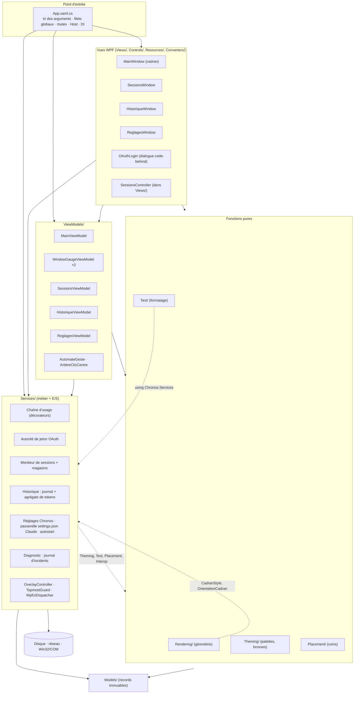
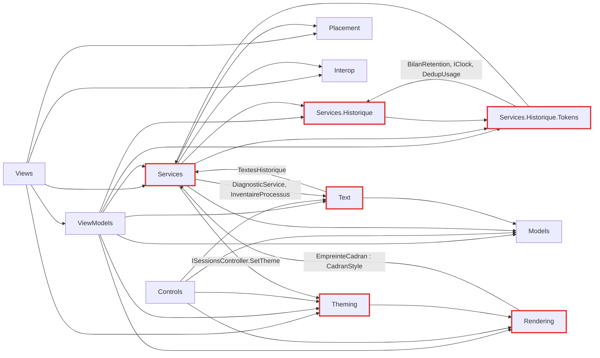
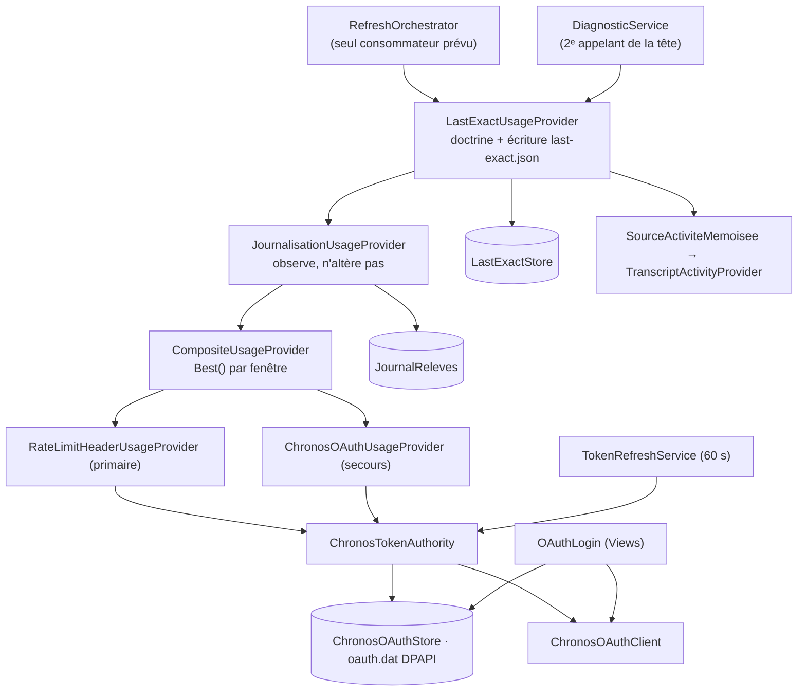

# Architecture — Chronos (overlay WPF d'usage Claude)

> Livrable des Phases 0 et 1 de la skill dev-senior (reconnaissance + rétro-ingénierie).
> **Aucun finding, aucun jugement** (loi 3). Les mentions « à confirmer » sont des écarts de compréhension,
> pas des défauts.
> Je n'ai lu que le code, les tests, les manifestes et `docs/`. `.zeus/` et `.planning/` n'ont pas servi de source.
> État lu : commit `aeb6f0f` (branche `main`), le 2026-10-04. Chemins relatifs à `src/Chronos/`, sauf mention contraire.

---

## Carte d'identité (Phase 0)

| Rubrique | Constat |
|---|---|
| Langages | C# (net8.0-windows, `LangVersion=latest`, `Nullable=enable`), XAML (WPF). Aucun autre langage versionné : `scripts/` ne contient qu'un README qui documente le retrait du pont Node. |
| Volumétrie | `src/` : 23 608 lignes C# (~170 fichiers) et 4 023 lignes XAML. `tests/` : 48 355 lignes C# (179 fichiers). Ratio tests/code ≈ 2,0. |
| Plus gros fichiers (src) | `Services/DiagnosticService.cs` (1 037), `Views/Reglages/ReglagesWindow.xaml` (1 004), `ViewModels/MainViewModel.cs` (875), `ViewModels/Historique/HistoriqueViewModel.cs` (636), `App.xaml.cs` (582), `Services/LecteurAppBureau.cs` (553), `Services/RateLimitHeaderUsageProvider.cs` (530). |
| Points chauds git (src) | 1 216 commits du 2026-07-08 au 2026-10-04. Fichiers les plus modifiés : `App.xaml.cs` (63), `DiagnosticService.cs` (49), `MainViewModel.cs` (39), `MainWindow.xaml` (35), `Chronos.csproj` (26), `SessionMonitor.cs` (25). |
| Écosystème | Un seul : .NET. `Chronos.sln` contient 2 projets : `src/Chronos/Chronos.csproj` (WinExe) et `tests/Chronos.Tests/Chronos.Tests.csproj` (xUnit 2.9.2 + Xunit.StaFact). Aucun CI (pas de `.github/`), aucun conteneur, aucun lockfile NuGet. |
| Dépendances NuGet | `CommunityToolkit.Mvvm` 8.4.2, `Microsoft.Extensions.Hosting` 8.0.1, `System.Security.Cryptography.ProtectedData` 8.0.0 (DPAPI). |
| Packaging | Profil `Properties/PublishProfiles/win-x64.pubxml` : exe self-contained mono-fichier, R2R, sans trim. Les propriétés de publication sont conditionnées à `PublishSingleFile=true` (`Chronos.csproj:28-37`). `app.manifest` : PerMonitorV2. Version 3.4.0 dans le csproj. 7 exe publiés à la racine (`Chronos-v3.1.0.exe` à `Chronos-v3.4.0.exe`), exclus par `.gitignore`. |
| Points d'entrée | Un seul exe, **six modes** décidés par `ArgumentsDemarrage.Trier` (`Services/ArgumentsDemarrage.cs:22-36`), dispatchés dans `App.OnStartup` (`App.xaml.cs:21-78`) : **Overlay** (normal) · **`--hook <Event>`** (processus court lancé par Claude Code) · `--cadrans`, `--sessions` et `--historique` (galeries visuelles, sans Host) · **ArgumentInconnu** (`Environment.Exit(0)` silencieux). |
| Services hébergés (Generic Host) | `TokenRefreshService` (tick 60 s), `JournalisationUsageProvider` (Start/Stop seulement), `ReconstructionTokens` (thread dédié BelowNormal, cadence 60 s), `RefreshOrchestrator` (boucle de rafraîchissement). Ordre d'inscription : `App.xaml.cs:455, 510, 522, 552`. |
| Minuteries UI | `MainViewModel.StartClock` 1 s (`MainViewModel.cs:780-785`) · `TopmostGuard` 2 s (`TopmostGuard.cs:23`) · `SessionsViewModel.StartClock` 2 s (`SessionsViewModel.cs:183-189`) · `HistoriqueViewModel` 60 s (`HistoriqueViewModel.cs:284`) · minuterie du clic central (`MainViewModel.cs:204-222`). |
| Dépendances externes | **Réseau** : `POST https://api.anthropic.com/v1/messages` (sonde, `RateLimitHeaderUsageProvider.cs:57`), `GET https://api.anthropic.com/api/oauth/usage` (`ChronosOAuthUsageProvider.cs:39`), `https://console.anthropic.com/v1/oauth/token` et `https://claude.ai/oauth/authorize` (`ChronosOAuthClient.cs:53-55`). **Fichiers lus** : `~/.claude/projects/**/*.jsonl`, `~/.claude/settings.json`, `%APPDATA%\Claude\claude-code-sessions\**\local_*.json` et son équivalent sous `%LOCALAPPDATA%\Packages\Claude_*\LocalCache\Roaming\…`. **Fichiers écrits** : `%APPDATA%\Chronos\{settings.json, last-exact.json, oauth.dat, archived.json, treated.json, chronos.log, sessions\*.json, historique\*, backups\*}`, `~/.claude/settings.json`, `shell:startup\Chronos.lnk`. **OS** : mutex `Local\Chronos-overlay`, COM `WScript.Shell`, Win32 (`SetWindowPos`, `MonitorFromWindow`, `GetForegroundWindow`, `GetDpiForMonitor`, `GetDoubleClickTime`). Aucune variable d'environnement attendue. |
| Outils de vérité-terrain | **Disponibles** : `dotnet` SDK 10.0.201. Build Debug sur une copie dans le scratchpad : **0 avertissement, 0 erreur**. `dotnet test --list-tests` : **2 152 cas** listés (théories dépliées), non exécutés. **Absents** : `tokei`, `cloc` (volumétrie faite avec `wc -l`), `jscpd` (clones : NON MESURÉS), `rg` (remplacé par grep). Analyseurs de complexité et métriques Roslyn : NON MESURÉS (non configurés). `dotnet list package --vulnerable` : non lancé. |

---

## Vue en couches

Le **style constaté** est un MVVM sur Generic Host. On a un *composition root* unique (`App.ConfigureServices`, `App.xaml.cs:318-581`), une couche Services qui compte ~110 fichiers et porte toute la logique métier, et des ViewModels CommunityToolkit qui consomment des contrats neutres (`IUsageProvider`, `IAuthStatus`, `IEtatServeur`, `IEtatJournal`, `IEtatReconstruction`, `ISessionsController`, `IWindowController`, `IOuvreurHistorique`…). À l'intérieur de Services, la chaîne d'usage suit une architecture **pipe-and-filter par décorateurs** (`IUsageProvider` imbriqués). Le mode `--hook` est un **second programme** logé dans le même exe : il partage les types de Services, mais pas le Host.

Couches **réelles**, qui ne se déduisent pas toujours du nom des dossiers :

1. **Composition root** : `App.xaml.cs`. Il enregistre ~60 services, décide de l'ordre de démarrage (VM résolu avant `StartAsync`, `App.xaml.cs:139`) et des étapes de convergence au lancement (autostart, réconciliation, balayage).
2. **Vues** : XAML et code-behind. Exceptions au sens dominant :
   - `Views/SessionsController.cs` et `Views/OAuthLogin.cs` sont des **services** (ils implémentent `ISessionsController` et `IOAuthLogin`) logés dans Views, parce qu'ils créent des fenêtres et des `MessageBox` ;
   - `MainWindow.xaml.cs` porte la répartition des gestes souris (code-behind, `MainWindow.xaml.cs:98-139`) et dépend directement d'un service concret (`OverlayController`).
3. **ViewModels** : CommunityToolkit (`[ObservableProperty]`, `[RelayCommand]`). Exceptions :
   - `MainViewModel` dépend de types concrets (`RefreshOrchestrator`, `SettingsService`, `DiagnosticService`), en plus des interfaces (`MainViewModel.cs:440-451`) ;
   - il instancie lui-même `ReglagesViewModel` et un second `ReglagesHistoriqueSurDisque` (`MainViewModel.cs:469-470`) ;
   - il crée des `DispatcherTimer` (`MainViewModel.cs:208, 782`) ;
   - `WindowGaugeViewModel` produit des `Brush` WPF (`WindowGaugeViewModel.cs:77-88`).
4. **Services** : logique métier, E/S et Win32. Les fichiers WPF de cette couche sont **exactement trois** : `OverlayController.cs`, `TopmostGuard.cs` et `WpfUiDispatcher.cs`. Un test (`ServicesLayerPurityTests`, cité dans `RefreshOrchestrator.cs:8-9`) garde une liste blanche de ces fichiers.
5. **Pur** : `Rendering`, `Text`, `Theming`, `Placement`. Ces dossiers sont sans E/S, mais `Rendering/*`, `Theming/*` et `ContrasteWcag` utilisent des types WPF (`Size`, `Color`, `Brush`, `Geometry`).
6. **Models** : records immuables (`UsageSnapshot`, `WindowState`, `ReleveJournal`, `TrancheTokens`…). Aucune dépendance sortante, à part des sous-espaces Models.

---

## Graphe de dépendances

### Entre projets

`Chronos.Tests` → `Chronos` (ProjectReference + `InternalsVisibleTo`, `Chronos.csproj:40-42`). Il y a aussi un couplage **non référentiel** : le projet de tests reçoit par MSBuild les chemins `src/Chronos` et `docs` (`Chronos.Tests.csproj`, `AssemblyMetadata CheminSourcesChronos / CheminDocsChronos`). **36 fichiers de tests** lisent le texte source ou la documentation (gardes « grep » de non-retour, contrats documentés). **59 fichiers de tests** instancient de vraies fenêtres WPF ou utilisent `StaFact`.

### Entre espaces de noms (les `using` et les noms qualifiés relevés)

**Cycles** (au niveau des espaces de noms ; tout est dans un seul assembly, donc le compilateur ne les interdit pas) :

- **C1** `Services → Theming → Rendering → Services`. Arêtes : `Services/ISessionsController.cs:1` (`using Chronos.Theming`), `Theming/ChronosTheme.cs:6` (`using Chronos.Rendering`), `Rendering/EmpreinteCadran.cs:2,11` (`CadranStyle`, défini dans `Services/ChronosSettings.cs:14`).
- **C2** `Services ↔ Text`. Arêtes : `Services/DiagnosticService.cs:9` et `Services/InventaireProcessus.cs:2` (`using Chronos.Text`), `Text/TextesHistorique.cs:3` (`using Chronos.Services`).
- **C3** `Services.Historique ↔ Services.Historique.Tokens`. Arêtes : `SourceHistoriqueDisque.cs:4` et `EtatJournalHistorique.cs:4` (vers Tokens), `Tokens/IndexMessages.cs:9` (vers Historique, pour `BilanRetention`, défini dans `JournalReleves.cs:14`).
- **C4** `Services ↔ Services.Historique` (sous-espace). Arêtes : `DiagnosticService.cs:7-8` ; `App` et la chaîne utilisent `JournalisationUsageProvider` ; `Historique/*` consomme `RateLimitHeaderUsageProvider.CadenceNominale`, `IClock` et `ChronosPaths`.

Il n'y a **aucun** cycle entre la couche Vues/ViewModels et Services : rien dans Services ne référence `Chronos.Views` ni `Chronos.ViewModels` (grep vide).

### Graphe d'objets de la chaîne d'usage (instancié dans `App.xaml.cs:502-540`)

---

## Flux de données

### F1 — Relevé d'usage → cadran (sonde d'en-têtes, secours OAuth, dernier exact, plancher)

**Déclencheurs**
- Tick périodique : `RefreshOptions` est dérivé de `ChronosSettings.RefreshIntervalSeconds`, 60 s par défaut (`App.xaml.cs:545-550`). Un `PeriodicTimer` écrit dans un `Channel(1, DropWrite)` (`RefreshOrchestrator.cs:21-23, 63-72`).
- Charge initiale : `RefreshOrchestrator.cs:46`.
- `RequestRefresh()` (`RefreshOrchestrator.cs:77`), appelé par la bascule de la sonde (`MainViewModel.cs:838`) et par le login (`MainViewModel.cs:849, 869`).
- Le consommateur unique attend un debounce de 300 ms, puis appelle `_provider.GetAsync` (`RefreshOrchestrator.cs:52-57`).

**Descente dans la chaîne** (de l'extérieur vers l'intérieur)
1. **Tête de doctrine** `LastExactUsageProvider.GetAsync` (`LastExactUsageProvider.cs:60-112`) délègue à l'inner (l. 62).
2. **Décorateur de journal** `JournalisationUsageProvider.GetAsync` (`Historique/JournalisationUsageProvider.cs:63-76`) délègue (l. 65). Voir F2 pour l'écriture.
3. **Composite** `CompositeUsageProvider.GetAsync` (`CompositeUsageProvider.cs:37-66`). Il appelle **les deux** sources sans court-circuit (l. 39, 42), puis `Best()` par fenêtre (l. 74-75) : le repli n'est retenu que s'il est *strictement* plus fiable. Le snapshot est **recomposé par `new`** (l. 59-65), et seuls `FiveHour`, `SevenDay` et `SourceCapturedAt` survivent.
4. **Sonde d'en-têtes** `RateLimitHeaderUsageProvider.GetAsync` (`RateLimitHeaderUsageProvider.cs:197-354`) :
   - relit l'interrupteur **frais** `SettingsService.Load().SondeEnTetesActivee` (l. 206) ;
   - frein temporel (l. 216) ;
   - jeton via l'autorité (l. 224) ;
   - `POST /v1/messages` avec `claude-haiku-4-5`, `max_tokens:1`, User-Agent `claude-code/2.1.30` et délai de 8 s (l. 516-529) ;
   - sur 401 : invalidation, puis un seul rejeu (l. 239-251) ;
   - lecture des en-têtes `anthropic-ratelimit-unified-*` (l. 373-441). L'utilisation est une fraction textuelle, le reset une époque en secondes, normalisés par `UsageNormalization.FractionDepuisTexteFraction` et `InstantDepuisTexteEpoch` (`UsageNormalization.cs:72-75, 115-118`) ;
   - le statut serveur et le dépassement sont portés par `WindowState` (l. 433-434) ;
   - matrice des codes HTTP : 429 avec en-têtes = exact (l. 275-304), 400/404 = recul de 60 min (l. 306-314), 2xx (l. 316-338), panne réseau = recul exponentiel de 60 s à 15 min (l. 503-509) ;
   - cache mémoire de 300 s (l. 158, 511-512) ;
   - le canal latéral `IEtatServeur` publie le dépassement par événement (l. 462-467).
5. **Secours OAuth** `ChronosOAuthUsageProvider.GetAsync` (`ChronosOAuthUsageProvider.cs:61-145`) :
   - intervalle minimal de 120 s, recul de 5 min sur 429, cache de 15 min (l. 42-44) ;
   - `GET /api/oauth/usage` (l. 149-160) ;
   - JSON `five_hour` / `seven_day` : `utilization` en **pourcentage 0..100**, converti en fraction (`FractionDepuisPourcentage`, l. 176-177) ; `resets_at` en ISO (l. 178-179).

**Remontée et doctrine** (`LastExactUsageProvider.cs:67-111`)
- Si au moins une fenêtre est Exact, `LastExactStore.Save(snap)` (l. 72-74). Le fichier est fusionné fenêtre par fenêtre avec l'existant (`LastExactStore.cs:107-147`), écrit en atomique (tmp + Move, l. 129-131) dans `%APPDATA%\Chronos\last-exact.json`, schéma `version:1`.
- Relecture `Load(now)`, qui écarte une fenêtre dont le reset est passé (`LastExactStore.cs:154-163, 220-236`), puis `UnExactADejaEteObtenu` (l. 176-177).
- Si une fenêtre candidate est plus vieille que `LimiteAge = CadenceNominale + 60 s = 360 s` (`DoctrineFraicheur.cs:36-37, 50-54`), le journal d'activité des transcripts est lu : `SourceActiviteMemoisee` (validité 60 s, `SourceActiviteMemoisee.cs:21, 36-61`) autour de `TranscriptActivityProvider.ReadAsync`. Cette lecture parcourt **tous** les `*.jsonl` modifiés depuis moins de 8 jours sous `~/.claude/projects`, ligne par ligne, avec déduplication par `message.id`/`requestId` en prenant le MAX par champ (`TranscriptActivityProvider.cs:55-101` ; `DedupUsage.cs:52-91`).
- `DoctrineFraicheur.Statuer` (`DoctrineFraicheur.cs:61-93`) produit l'un de ces états :
  - candidat absent → Unavailable ;
  - âge ≤ 360 s → **Exact / Frais** ;
  - journal absent ou ne couvrant pas la période → Unavailable ;
  - aucune activité depuis la capture → **Exact / EncoreValide** ;
  - sinon → **Estimated / PlancherAvecActivite**, avec `TokensDepuisReleve`.
- Le snapshot est retourné **avec `with`** (l. 106-111). `UnExactADejaEteObtenu` n'est posé qu'ici.

**Vers l'UI**
- `SnapshotChanged` est levé sur le thread pool (`RefreshOrchestrator.cs:57`) → `MainViewModel.OnSnapshotChanged` → `_ui.Post` (`MainViewModel.cs:547`). `WpfUiDispatcher.Post` exécute directement s'il est déjà sur le thread UI, sinon il passe par `BeginInvoke` (`WpfUiDispatcher.cs:14-18`).
- `ApplySnapshot` (`MainViewModel.cs:595-616`) appelle `WindowGaugeViewModel.Apply` ×2 (`WindowGaugeViewModel.cs:101-143`) : texte de pourcentage avec « ≥ » selon la provenance (`PercentFormatter`), brosse via `ChronosTheme.ArcBrush`, statut serveur, tokens. Suivent les pastilles, l'état de la sonde, l'état du journal et de la reconstruction (lus par interrogation à chaque snapshot, l. 611-613), l'infobulle de source (l. 743-759) et `Interpolate` (l. 762-777).
- Entre deux snapshots, le timer de 1 s rappelle `Interpolate` : fraction de temps restante, compte à rebours, heure de reset, angles de la timeline 24 h (`WindowGaugeViewModel.cs:163-182`, `Rendering/DayTimeline.cs`).
- XAML : cinq vues de cadran superposées dont la visibilité suit `IsStyle*` (`Views/MainWindow.xaml:40-50`), chacune liée à `FiveHour` / `SevenDay`.

**Changements de forme** : en-tête texte (fraction) / JSON (pourcentage) → `WindowState` (fraction 0..1) → `Entry` sérialisée (`LastExactStore.cs:247-252`) → `WindowState` reconstruit avec `Source = MagasinDernierExact` → `WindowGaugeViewModel` (scalaires observables, `Brush`).

**Copies de la donnée** :
- trois caches mémoire indépendants : sonde 300 s, OAuth 15 min, journal d'activité 60 s ;
- le fichier `last-exact.json` ;
- `_last` dans le VM (`MainViewModel.cs:47`) ;
- `_state` dans chaque jauge (`WindowGaugeViewModel.cs:19`).

### F2 — Journal des relevés et agrégats de tokens → fenêtre Historique

**F2a, écriture du journal des relevés** (sur le chemin de F1)
- `JournalisationUsageProvider.Journaliser` (`JournalisationUsageProvider.cs:106-149`) retient les fenêtres Exact dont la source n'est pas `MagasinDernierExact` (l. 152-157), puis les groupe par (instant de capture, source).
- Idempotence en mémoire : `_dernierT` par source, amorcé par la queue du fichier (l. 130-133).
- Événement `Reprise` si le trou dépasse `SeuilReprise = 600 s` (l. 135-140 ; `JournalReleves.cs:51`).
- `JournalReleves.AjouterReleve` (`JournalReleves.cs:136-146`) : ouverture `OpenOrCreate` avec `FileShare.None`, relecture des 16 Ko de queue **sous le même verrou** pour l'idempotence (l. 219-248, 270-291), ajout d'une ligne JSONL dans `%APPDATA%\Chronos\historique\releves-YYYY-MM.jsonl` (l. 125-126).
- Les événements `Demarrage`, `Arret`, `SondeRefusee`, `JetonInvalide`, `EcritureRatee` et `Reprise` partagent ce fichier (l. 149-158). Ils sont émis par `JournalisationUsageProvider.StartAsync/StopAsync` (l. 78-98), sur transition de la sonde (l. 164-182) ou de l'authentification (l. 184-192), et par `LastExactStore.EcritureRatee` câblé dans `App.xaml.cs:534`.
- Sérialisation : `LigneJournal.Serialiser` (`Historique/LigneJournal.cs:80, 98`).
- Rétention : 24 mois, purge unique au démarrage (`JournalReleves.cs:180-211`, appelée depuis `JournalisationUsageProvider.cs:80`).

**F2b, reconstruction des agrégats de tokens** (indépendante de F1)
- `ReconstructionTokens.ExecuteAsync` crée un thread dédié BelowNormal, synchrone, en boucle toutes les 60 s (`Tokens/ReconstructionTokens.cs:153-177`).
- `Initialiser` (l. 296-342) : purge ; chargement de `curseurs.json`, `couverture.json` et des shards d'ids ; détection des mois « gelés » (l. 316-321) ; reprojection des mois ouverts depuis l'index (`ProjectionAgregats.Projeter`, l. 327-338).
- Passe (l. 181-289) : inventaire des `*.jsonl` triés par date de modification décroissante (l. 346-369), classement par curseur (`Curseurs.Classer`, `Tokens/Curseurs.cs:113`), lecture incrémentale depuis l'offset (`LecteurTranscript.Lire`, `Tokens/LecteurTranscript.cs:75` ; parsing d'usage par `DedupUsage.LireUsage`, l. 204).
- Pour chaque `MessageLu` : clé synthétique si l'id manque (l. 414-416) ; chargement à la demande du shard du mois (l. 377-386) ; `IndexMessages.Ajouter` (`Tokens/IndexMessages.cs:206`, fusion MAX via `DedupUsage.Fusionner`, l. 215) ; `MagasinAgregats.Appliquer` sur une tranche de 15 min UTC × modèle × sous-agent (`Tokens/MagasinAgregats.cs:166`).
- `Flush` ordonné (l. 428-467) : ids ouverts, puis agrégats sales (`EcrireMoisSales`, `MagasinAgregats.cs:221`), puis ids gelés, puis curseurs. La couverture est écrite en fin de passe complète (l. 256-263).
- Fichiers produits dans `historique\` : `tokens-YYYY-MM.jsonl`, `ids-YYYY-MM.jsonl`, `curseurs.json`, `couverture.json`.
- L'état observable passe par `IEtatReconstruction` (champs `Volatile`, l. 127-147) et l'événement `Changement`, levé **une fois par fichier**, sur le thread de fond (l. 240).

**F2c, lecture vers la fenêtre Historique**
- Ouverture : double-clic sur le cadran (F6), ou bouton dans les réglages (`MainViewModel.cs:232-233`) → `OuvreurHistorique` (fenêtre unique recréée, `Views/OuvreurFenetreUnique.cs`) → `HistoriqueWindow.Loaded` → `vm.Ouvrir()` puis `DemarrerHorloge()` (`Views/Historique/HistoriqueWindow.xaml.cs:80-84`).
- `HistoriqueViewModel.Ouvrir` (`HistoriqueViewModel.cs:264-271`) : repère hebdo lu **de façon synchrone sur le thread UI** (`SourceHistoriqueDisque.RepereHebdo`, `SourceHistoriqueDisque.cs:26-38`) et ancre `WeeklyAnchor` lue dans les réglages.
- `DemanderLecture` (l. 383-418) : lecture **numérotée** sur `Task.Run` ; le résultat est appliqué via `_ui.Post` seulement si le numéro est toujours courant.
- `SourceHistoriqueDisque` (`SourceHistoriqueDisque.cs:41-110`) combine :
  - `LecteurJournal.Lire` (`LecteurJournal.cs:122`) → `AnalyseReleves.Analyser` (`AnalyseReleves.cs:29`) ;
  - `LecteurAgregats.Lire` (`Tokens/LecteurAgregats.cs:34`) → `RenduLocalTokens.ParHeure` / `ParQuartDHeure`, dans le fuseau injecté, avec `couverture.json` **relu à chaque appel** (l. 113) ;
  - `Divergences.Detecter`.
  Chaque méthode capture toute exception et rend une donnée vide marquée `LectureIncomplete` (l. 58-61, 81-84, 106-109).
- Rafraîchissement : tick de 60 s (relecture seulement si un magasin a bougé, l. 299 et suivantes) ; bandeau de progression sur `Changement`, coalescé par un drapeau atomique (`HistoriqueViewModel.cs:611-619`).
- Changements de forme : ligne JSONL → `ReleveJournal` / `EvenementJournal` → `LectureJournal` → `AnalyseJournal` → `DonneesSemaine` / `DonneesJour` / `DonneesQuatreSemaines` → contrôles de piste (`Controls/Historique/Piste*.cs`).

### F3 — Hooks Claude Code `--hook` → fichiers d'état → widget de sessions

**Installation du câblage**
- `SessionHookInstaller.Cablage` déclare 8 événements : SessionStart, UserPromptSubmit, Stop, SessionEnd, PermissionRequest, Notification (avec matcher), PreToolUse et PostToolUse (timeout de 3 s pour ces deux derniers) (`SessionHookInstaller.cs:111-122`).
- Ils sont écrits par `ApplyHooks` (l. 242-318) sous la forme `"<exe avec slashes>" --hook <Event>` (l. 151-152). Chaque nom est validé contre `CatalogueEvenementsHooks` (33 événements, `CatalogueEvenementsHooks.cs:30-73`).
- L'écriture passe par F5 (passerelle) : à l'activation du widget (`SessionsController.Enable`, `Views/SessionsController.cs:41-61`) et à chaque démarrage (réconciliation).

**Processus `--hook`** (un processus par événement, potentiellement plusieurs en parallèle)
- `App.OnStartup` → `RunSessionHook` (`App.xaml.cs:35-39, 246-273`), **sans** mutex, Host ni filet global.
- stdin UTF-8 → `SessionHookProcessor.Process` (`SessionHookProcessor.cs:71-168`) :
  - lit `session_id`, `cwd`, `notification_type`, `agent_id`, `agent_type` et `hook_event_name` ;
  - valide l'identifiant (`^[A-Za-z0-9_-]{1,128}\z`, l. 63-69) ;
  - filtre les sous-agents (l. 122-125) et les notifications sans état (l. 48-53, 133-136) ;
  - associe un état : PermissionRequest et Notification → `WaitingAttention`, Stop → `WaitingTurn`, les autres → `Working`. SessionEnd déclenche une suppression (l. 127) ;
  - construit le JSON `{session_id, project, activity, reason?, updated_at(ms)}` (l. 171-185).
- `EcritureEtatSession.Appliquer` (`EcritureEtatSession.cs:59-102`) :
  - garde de chemin (l. 71-74) ;
  - écriture **en place**, sous `FileShare.Read` ;
  - relecture de l'état présent sous le même handle, et refus d'une écriture plus ancienne (l. 181-215, 240-267) ;
  - un battement de sous-agent ne crée jamais l'état (`FileMode.Open`, l. 187).
- Destination : `%APPDATA%\Chronos\sessions\<id>.json` (`App.xaml.cs:259-260`). Si Claude Code tourne sous l'app bureau MSIX, ce chemin est **virtualisé** vers `%LOCALAPPDATA%\Packages\Claude_*\LocalCache\Roaming\Chronos\sessions` (`RacinesEtat.cs:72-73`).
- Code de sortie : 0 en cas de succès, 1 en cas d'échec, jamais 2 ; le message va sur stderr en UTF-8 (`App.xaml.cs:263-288`).

**Lecture par l'overlay**
- `RacinesEtat.ParDefaut()` est résolu une fois (`App.xaml.cs:366`) et donne deux listes : les racines des états de hooks (paquets MSIX d'abord, puis `%APPDATA%`) et les racines de l'app bureau (`RacinesEtat.cs:48-81`).
- `SessionsViewModel.StartClock` relance `Refresh` toutes les 2 s (`SessionsViewModel.cs:183-231`) → `SessionMonitor.Read` → `Inspecter` (`SessionMonitor.cs:119-252`). Les signaux viennent de **trois sources** :
  1. **transcripts** : `TranscriptSessionSource.Read` lit la queue de 64 Ko des `*.jsonl` modifiés depuis moins de 8 h et retient au plus 12 sessions ; il infère l'état du dernier message (`assistant` sans `tool_use` = WaitingTurn, `AskUserQuestion` = WaitingAttention) et les sous-agents (`TranscriptSessionSource.cs:72-223`) ;
  2. **fichiers d'état des hooks** : toutes les racines ; un fichier dont l'âge dépasse 8 h est écarté (`SessionMonitor.cs:143-161, 298-328`) ;
  3. **métadonnées de l'app bureau** : `LecteurAppBureau.Lire` lit `local_*.json` (`lastFocusedAt`, `cliSessionId`, classification de fin de tour), avec cache par (date de modification, taille) et épisodes figés (`LecteurAppBureau.cs:196-324, 346-348, 430-447`). Une session « bloquée » devient un signal `WaitingAttention` (`SessionMonitor.cs:169-182, 263-270`).
- Transformations :
  - `AppliquerSilence` : Working depuis plus de 20 min → `WaitingDeduced` (`SessionMonitor.cs:290-293` ; `HorizonsSessions.cs:27`) ;
  - `TravailSousAgent.SansEffacerLesAttentes`, puis `ArbitrageSessions.Trancher` : fraîcheur > spécificité de la source > rang d'état > motif > projet (`ArbitrageSessions.cs:98-153`) ;
  - lecture du premier plan Win32 (`PremierPlanWin32.Lire`, `PremierPlanWin32.cs:106-153`) ;
  - **`SessionTreatmentTracker.Observe` écrit dans `TreatedStore`** pendant la lecture (`SessionMonitor.cs:210` ; `SessionTreatmentTracker.cs:116-182`) ;
  - enrichissement par le titre de l'app bureau (l. 274-275) ;
  - masquage des sessions archivées (`archived.json`), traitées (`treated.json`, rétention 24 h) ou indéterminées (l. 231-250).
- `SessionsViewModel.Refresh` **reconstruit** `Items` (`Clear` + `Add`) à chaque tick (l. 198-221). Les commandes Archiver et Marquer traité écrivent `ArchiveStore` / `TreatedStore` via `MagasinMapSessions`, qui est tolérant et met en quarantaine (`MagasinMapSessions.cs:94-167` ; `QuarantaineFichier.cs:28-68`).
- Nettoyage : `BalayageMagasinSessions.Balayer` s'exécute une fois au démarrage (`App.xaml.cs:183`). Il supprime les `.json.tmp-*` de plus d'1 h et les états de plus de 72 h, sauf les sessions attestées vivantes par les transcripts (`BalayageMagasinSessions.cs:83-131`).

### F4 — Réglages Chronos : lecture tolérante, quarantaine, `Modifier`

- Fichier : `%APPDATA%\Chronos\settings.json` (`ChronosPaths.cs:23`). Modèle : `ChronosSettings` (record de 27 propriétés, `ChronosSettings.cs:44-138`).
- **Lecture** `SettingsService.Load` (`SettingsService.cs:137-197`), sous verrou :
  - 5 tentatives de lecture ;
  - `JsonNode.Parse` avec commentaires et virgules finales tolérés ;
  - **retombée par propriété** : une valeur de type invalide, un null sur un champ non nullable ou un enum hors plage sont retirés du nœud et listés (l. 174-179, 322-336) ;
  - désérialisation du reste.
  - L'issue (`Absent` | `Lu` | `LuAvecRetombees` | `Illisible` | `Inaccessible`) est mémorisée dans `_derniereLecture` (`LectureReglages.cs:4-34`). Une lecture non fiable rend les **défauts** et incrémente un compteur (l. 200-209).
- **Lecture de démarrage** : `ChargerPourDemarrage` fige `LectureDuDemarrage` (l. 213-221). Elle est enregistrée comme singleton `ChronosSettings` (`App.xaml.cs:346`) et consommée par `RefreshOptions`, `MainWindow.ApplyRestoredState` et la réconciliation.
- **Écriture** `Modifier(mutation)` (`SettingsService.cs:230-241`), la seule voie utilisée par le code (tous les appelants sont listés plus bas) : `Load` → `PreparerEcriture`, qui fonctionne ainsi :
  - lecture fiable → écriture ;
  - `Inaccessible` → refus journalisé ;
  - `Illisible` → **quarantaine** : déplacement vers `settings.illisible-YYYYMMDD-HHMMSS[-n].json`, incident journalisé et pose du marqueur `QuarantaineReglagesDepuis` (l. 265-318).
  - Ensuite viennent la mutation, puis `Ecrire` : court-circuit si le texte est identique, sinon tmp unique + Move avec 5 tentatives (l. 342-386).
- `Save(settings)` existe (l. 247-263), mais aucun appelant n'a été trouvé dans `src/`.
- Appelants de `Modifier` :
  - `MainViewModel.cs:323, 348, 363, 390, 424, 824, 837` (orientation, style de cadran, style de sessions, disposition, thème, mode, sonde) ;
  - `OverlayController.cs:108, 230, 238` (coin, moniteur, X/Y, arrière-plan) ;
  - `SessionsController.cs:49, 68, 129` (widget, et effacement du marqueur de quarantaine ; position) ;
  - `HistoriqueViewModel.cs:331` et `ReglagesViewModel.cs:132, 161` (via `ReglagesHistoriqueSurDisque.Modifier`, `Historique/ReglagesHistorique.cs:27-31`).
- **Lecteurs « frais »** (un `Load()` à chaque appel) : `RateLimitHeaderUsageProvider.cs:206` (à chaque tick), `SessionsController.IsEnabled` (`SessionsController.cs:39`), `OverlayController.cs:202`, `DiagnosticService.cs:136`, `ReglagesHistoriqueSurDisque.Lire` (lu par `HistoriqueViewModel` et `ReglagesViewModel`), `MainViewModel` constructeur (`MainViewModel.cs:465`).
- **États dupliqués** : `MainViewModel._settings` (copie mise à jour au retour de chaque `Modifier`), le singleton `ChronosSettings` (instantané de démarrage, jamais rafraîchi) et le fichier.

### F5 — Réconciliation de `~/.claude/settings.json` et autostart au démarrage

Séquence dans `App.OnStartup` (mode Overlay seulement) :

1. **Autostart** `AutostartService.ConvergerVersExeCourant` (`AutostartService.cs:115-138`), appelé à `App.xaml.cs:118-128`. Lien absent → rien. Lien conforme → rien. Exe courant situé dans `bin\` ou dans le Temp → `Ignore` (l. 144-160). Cible présente et de version supérieure ou égale (`FileVersionInfo`) → `Ignore`. Sinon `Enable()` repointe le `.lnk` via COM `WScript.Shell` (l. 82-106). Le bilan va dans `chronos.log` (`App.xaml.cs:121-126`). La case de l'UI lit ensuite `IsEnabled()` (`MainViewModel.cs:474`).
2. Lecture brute de l'ancienne commande de barre de statut (clé héritée) dans les réglages Chronos (`App.xaml.cs:133-134` ; `ClaudeSettingsReconciler.cs:132-158`).
3. Résolution du VM, `StartAsync`, `Show` (l. 139-150).
4. **Réconciliation** `ClaudeSettingsReconciler.Reconcile` (`ClaudeSettingsReconciler.cs:252-296`), appelée à `App.xaml.cs:158-170` :
   - `hooksVoulus` = `null` si la lecture de démarrage des réglages n'est pas fiable, sinon `SessionsWidgetEnabled` (l. 163-164) ;
   - `conserverHooks` = marqueur de quarantaine posé (l. 168).
   - Elle passe par `PasserelleReglagesClaude.Lire` (`PasserelleReglagesClaude.cs:80-117`) : issue tri-état, 3 tentatives, mémorisation de la date de modification et de la taille.
   - `ReconcileJson` (l. 185-207) applique `ApplyHooks` selon le vœu, puis `RetirerBarreChronos` : retrait, ou restauration de la commande héritée, et une barre tierce reste intacte (l. 215-232). Il compare la forme normalisée avant et après, et retourne null si rien ne change.
   - `PasserelleReglagesClaude.Ecrire` (l. 125-173) :
     - refus si la lecture est inexploitable, si le fichier est absent sans `creerSiAbsent`, ou s'il s'agit d'un lien symbolique ;
     - **sauvegarde** dans `%APPDATA%\Chronos\backups\claude-settings-<horodatage>[-n].json` (5 conservées) plus une épingle `claude-settings-initial.json` (l. 188-269) ;
     - tmp, contrôle « inchangé » (date de modification + taille, l. 176-182), puis Move atomique.
   - Le bilan est conservé dans `DernierBilan` et relu par le diagnostic.
5. Journal de démarrage (F8), balayage (F3), `ShowIfEnabled` du widget (l. 175-187).

Les mêmes primitives (`ClaudeSettingsJson`, `PasserelleReglagesClaude`) servent `SessionHookInstaller.Install/Uninstall` (`SessionHookInstaller.cs:159-188`) quand l'utilisateur active ou désactive le widget. **Une seule instance** de la passerelle est partagée (`App.xaml.cs:396-403`).

### F6 — Gestes souris sur le cadran

- Événements de la grille `Racine` : `MouseLeftButtonDown`, `MouseMove`, `MouseLeftButtonUp`, `LostMouseCapture` et `MouseRightButtonUp` (`Views/MainWindow.xaml:25-27`).
- **Appui** (`MainWindow.xaml.cs:98-107`) :
  - test de silhouette : on cherche la première `Shape` visible marquée `ZoneGeste.Silhouette` (`ZoneGeste.cs:32-60`), puis `RenderedGeometry.FillContains` (l. 48). Les silhouettes sont déclarées dans chaque vue de cadran avec le pinceau `ZoneSilhouette` (alpha 1) (`Views/Cadrans/*.xaml`, par exemple `CadranArcsView.xaml:15`) ;
  - `AutomateGeste.Appui` (`AutomateGeste.cs:84-99`) : avec `ClickCount ≥ 2` → clic immédiat ; sinon état `Appuye` et capture de la souris.
- **Déplacement** : au-delà du seuil système (`AutomateGeste.cs:103-115`) → `DragMove()` bloquant, puis `SnapToNearestCorner` au retour (`MainWindow.xaml.cs:111-124`). `OverlayController.SnapToNearestCorner` (`OverlayController.cs:74-115`) passe par Win32 et `CornerSnap`, puis **persiste** le coin, le moniteur et X/Y par `SettingsService.Modifier`.
- **Relâchement** : `AutomateGeste.Relache` → `Clic(1)` (`MainWindow.xaml.cs:128-133`).
- **Arbitrage simple / double clic** : `MainViewModel.ClicCentre` (`MainViewModel.cs:189-228`) et `ArbitreClicCentre` (`ArbitreClicCentre.cs:48-81`). Le délai vient de `GetDoubleClickTime` (`MainWindow.xaml.cs:42-43`). Un simple clic est armé puis basculé à l'échéance d'un `DispatcherTimer` (affichage pourcentage ↔ compte à rebours, `ToggleCenterMode`). Un double clic ouvre l'Historique (`_ouvreurHistorique.Ouvrir()`).
- **Clic droit** : `OuvreurReglages.Ouvrir()` (`MainWindow.xaml.cs:144-148`). Le contexte de la fenêtre de réglages est le `MainViewModel` lui-même (`App.xaml.cs:340`).
- **Pastilles** : boutons « invitation à se connecter » et « déconnexion » → `ReconnecterCommand` (`MainWindow.xaml:164-190`). Comme ce sont des `Button`, l'événement est marqué traité et le répartiteur de la racine ne le voit pas.
- Effets annexes : `SizeChanged` recale sur le coin courant, sauf pendant un glisser (`MainWindow.xaml.cs:66-76`) ; `DpiChanged` et `WM_DISPLAYCHANGE` relancent l'accrochage (`MainWindow.xaml.cs:62` ; `OverlayController.cs:211-215`).

### F7 — Login OAuth et rafraîchissement du jeton

- **Login** (PKCE, flux « code à copier »). Déclencheurs : `LoginClaudeCommand` dans les réglages (`MainViewModel.cs:843-850`) ou `ReconnecterCommand` depuis une pastille (`MainViewModel.cs:862-870`). Ensuite `OAuthLogin.LoginAsync` (`Views/OAuthLogin.cs:30-42`) :
  - `CreatePkce` et `BuildAuthorizeUrl` (`ChronosOAuthClient.cs:73-96`) ;
  - dialogue modal, ouverture du navigateur par `Process.Start` (l. 86-90) ;
  - l'utilisateur colle `code#state`, puis `ExchangeCodeAsync` (`ChronosOAuthClient.cs:99-112, 161-166`) ;
  - `ChronosOAuthStore.Save` chiffre en DPAPI (CurrentUser) puis écrit en atomique `%APPDATA%\Chronos\oauth.dat` (`ChronosOAuthStore.cs:32-41`).
  - Après une reconnexion réussie : `IAuthStatus.ReinitialiserApresLogin()` (`ChronosTokenAuthority.cs:142-150`) et `RequestRefresh`. `LoginClaude` bascule login/logout : `Logout` = `ChronosOAuthStore.Clear` (`OAuthLogin.cs:28`), puis `RequestRefresh`, **sans** `ReinitialiserApresLogin` (voir les zones non élucidées).
- **Autorité unique** `ChronosTokenAuthority.GetAccessTokenAsync` (`ChronosTokenAuthority.cs:70-132`), sous `SemaphoreSlim` :
  - copie mémoire `_jetons ??= _coffre.Load()` (l. 76) ;
  - refus définitif verrouillé (l. 84) ;
  - rafraîchissement si l'échéance est à moins de 12 min ou après une invalidation (l. 89, 173-174) ;
  - fenêtre de recul de 2 à 30 min (l. 99, 124-128) ;
  - `ChronosOAuthClient.RefreshAsync` (`ChronosOAuthClient.cs:122-158`) : 400/401 = identifiants rejetés, autres codes = échec temporaire ;
  - en cas de succès, `Save` dans le coffre, best-effort (l. 109).
- L'état `EtatAuthentification` (`NonConnecte` | `Connecte` | `HorsLigne` | `Deconnecte`) est publié par l'événement `EtatChange` (l. 181-186). Ses consommateurs :
  - `MainViewModel.SurEtatAuthChange` → pastilles (`MainViewModel.cs:520-521, 550, 572-592`) ;
  - `JournalisationUsageProvider.SurEtatAuth` → événement `JetonInvalide` (`JournalisationUsageProvider.cs:184-192`).
- Signaux remontés par les consommateurs : `InvaliderAccessToken` sur 401, `SignalerRefusServeur` sur 401/403 après rejeu, `SignalerSucces` sur 2xx (`RateLimitHeaderUsageProvider.cs:242, 269, 291, 318` ; `ChronosOAuthUsageProvider.cs:89, 107, 134`).
- **Horloge de fond** : `TokenRefreshService` utilise un `System.Threading.Timer` (premier tick immédiat, puis toutes les 60 s) → `GetAccessTokenAsync` (`TokenRefreshService.cs:45-73`).

### F8 — Diagnostic et `chronos.log`

- **Rapport** `DiagnosticService.BuildReportAsync` (`DiagnosticService.cs:131` et suivantes) :
  - lit `SettingsService` (lecture de démarrage prioritaire, l. 136-143) ;
  - **appelle la tête de chaîne** `_composite.GetAsync` (l. 157), le paramètre nommé `composite` recevant l'`IUsageProvider` de tête (`App.xaml.cs:558`) ;
  - assemble ensuite les sections, chacune à partir des instances partagées : [Chaîne de données] (l. 169), autorité, `IEtatServeur`, [Transcripts JSONL] (l. 240), [Magasins persistants] via 5 `IEtatMagasin` (l. 257 ; `App.xaml.cs:572-573`), journal d'historique (l. 676-736, qui relit le journal par la même façade que la fenêtre), [Ce qui est affiché maintenant] (l. 320), [Widget sessions] (l. 333 ; relit `~/.claude/settings.json` à la l. 348 et **appelle `SessionMonitor.Inspecter`** à la l. 469), [Réglages de Claude Code] (l. 528, d'après `ClaudeSettingsReconciler.DernierBilan`).
  - `oauth.dat` n'est testé qu'en existence (l. 215-216).
- **Déclencheurs** :
  - (a) au démarrage, en fire-and-forget : `LogStartupAsync` (`App.xaml.cs:175` ; `DiagnosticService.cs:111-128`) ;
  - (b) à la demande : section Diagnostic des réglages → `ReglagesViewModel.ActualiserDiagnostic` → `Task.Run(BuildReportAsync)` (`MainViewModel.cs:470` ; `ReglagesViewModel.cs:165-184`), avec copie possible dans le presse-papiers (`IPressePapiers`).
- **`chronos.log`** (`%APPDATA%\Chronos\chronos.log`) a deux écrivains :
  - `LogStartupAsync` **réécrit** le fichier : la fin de l'ancien journal (≤ 1 Mo, `JournalIncidents.LireFin`, l. 149-167) est relue, ses 50 dernières lignes `[incident]` sont reportées en tête, et le rapport suit (`JournalIncidents.ComposerJournalDemarrage`, l. 127-139) ;
  - `JournalIncidents.Signaler` (`JournalIncidents.cs:61-100`) **ajoute** une ligne horodatée en `AppendAllText`. Il est limité par processus et par dossier (`LimiteurIncidents` : 3 occurrences pleines par clé, puis un résumé toutes les 10 min, plafond de 200 lignes ; `LimiteurIncidents.cs:29-87`).
  - Producteurs d'incidents : les filets globaux UI, domaine et tâches non observées (`App.xaml.cs:217-234` ; `FiletExceptions.cs`), l'échec de démarrage (l. 189-195), l'autostart (l. 121-126), les quarantaines et refus de `SettingsService` (`SettingsService.cs:306, 396`) et de `MagasinMapSessions` (l. 159), et l'arrêt dépassé (`ArretHote.SignalerDepassement`, `ArretHote.cs:72-76`, appelé depuis `App.OnExit`, `App.xaml.cs:299-308`).

---

## Frontières implicites et couplages invisibles

1. **Partage d'instances par DI comme mécanisme de cohérence.**
   - Plusieurs singletons sont réexposés sous une seconde interface pour garantir « une seule instance » : `ChronosTokenAuthority` en `IAuthStatus` (`App.xaml.cs:450`), `RateLimitHeaderUsageProvider` en `IEtatServeur` (l. 480), `JournalReleves` en `IEtatJournal` (l. 489), `ReconstructionTokens` en `IEtatReconstruction` et en hosted service (l. 521-522), `RefreshOrchestrator` en hosted service (l. 551-552), `OverlayController` en `IWindowController` (l. 348).
   - La correction repose sur l'ordre et la forme des enregistrements, pas sur le graphe de types.
   - Le VM reçoit `IEtatServeur`, `IEtatJournal`, `IEtatReconstruction`, `IOuvreurHistorique`, `HistoriqueViewModel` et `IPressePapiers` comme **paramètres optionnels**. Ils ne sont injectés que parce qu'ils sont enregistrés (`MainViewModel.cs:446-451`).
2. **Ordre de démarrage porteur de sens** (`App.xaml.cs`) :
   - VM résolu avant `StartAsync` pour s'abonner à `SnapshotChanged` (l. 136-139) ;
   - autostart avant la résolution du VM (l. 114-128) ;
   - lecture brute de la clé héritée avant tout `Save` (l. 130-134) ;
   - réconciliation après `Show` et avant le journal de démarrage (l. 152-175) ;
   - ordre d'inscription des hosted services : journal et reconstruction avant l'orchestrateur (l. 499-501, 512-516).
3. **Événements traversant les threads** :
   - `SnapshotChanged` (thread pool), `EtatChange` (thread de l'appelant de `GetAccessTokenAsync` : orchestrateur, timer du jeton ou diagnostic), `DepassementChange` (thread de la sonde) et `Changement` (thread `Chronos.AgregatsTokens`) ;
   - tous sont remarshalés par `IUiDispatcher.Post` côté VM ;
   - `LastExactStore.EcritureRatee` est câblé par lambda dans la fabrique DI (`App.xaml.cs:534`).
4. **Appelants concurrents de la chaîne d'usage.**
   - `RefreshOrchestrator` est documenté comme « consommateur unique » (`RefreshOrchestrator.cs:10-11, 50`).
   - `DiagnosticService.BuildReportAsync` appelle pourtant le même `IUsageProvider` de tête hors du canal : au démarrage, en fire-and-forget, et depuis les réglages sur `Task.Run`.
   - Les providers ont des champs d'état mutables non verrouillés : `_cache`, `_prochainAppelAutorise`, `_reculReseau` (`RateLimitHeaderUsageProvider.cs:165-168`) et `_cached`, `_nextAllowedCall` (`ChronosOAuthUsageProvider.cs:50-52`).
   - `JournalisationUsageProvider` sérialise par `lock` (l. 108) ; `LastExactStore` n'a pas de verrou.
5. **Lecture qui écrit.**
   - `SessionMonitor.Inspecter` appelle `SessionTreatmentTracker.Observe`, qui fait `TreatedStore.Set` et `Remove` (`SessionMonitor.cs:210` ; `SessionTreatmentTracker.cs:134, 170, 181`).
   - `Inspecter` est appelé par le timer UI du widget (2 s) **et** par le diagnostic (thread pool).
   - `SessionTreatmentTracker` n'a pas de `lock` (grep vide), alors que `LecteurAppBureau` et `PremierPlanWin32` en ont un.
6. **État partagé par le système de fichiers, entre processus.**
   - Les processus `--hook` (N en parallèle) et l'overlay partagent `sessions\*.json`. La coordination passe par les modes de partage et le contrôle `updated_at` (`EcritureEtatSession.cs:187-199`).
   - Plusieurs exe Chronos (versions coexistantes) peuvent écrire `historique\*.jsonl` : verrou exclusif et reprises (`JournalReleves.cs:224-240`).
   - `~/.claude/settings.json` est partagé avec Claude Code lui-même : contrôle date de modification + taille juste avant le Move (`PasserelleReglagesClaude.cs:158-164`).
   - L'unicité de l'overlay repose sur le mutex `Local\Chronos-overlay` (`VerrouInstanceUnique.cs:59-73`), tenu par un champ **statique** (`App.xaml.cs:19`).
7. **Virtualisation MSIX d'AppData.**
   - Le même chemin logique `%APPDATA%\Chronos\sessions` désigne deux dossiers physiques selon le processus parent. L'overlay sonde les deux, paquets d'abord (`RacinesEtat.cs:72-80`).
   - `DetecteurVueAppData` (`VueAppData.cs:27-38`) sert au diagnostic.
   - Ce couplage est environnemental : il est invisible dans le code d'écriture (`App.xaml.cs:259-260`).
8. **Statiques globaux** :
   - `JournalIncidents.Limiteurs` (`ConcurrentDictionary` statique par dossier, `JournalIncidents.cs:170-179`) ;
   - `App._verrou` (statique) ;
   - catalogues statiques `ThemeCatalog`, `CatalogueEvenementsHooks`, `SessionHookInstaller.Cablage` et `HorizonsSessions` ;
   - constantes croisées : `JournalReleves.SeuilReprise` et `SeuilMuet` ainsi que `DoctrineFraicheur.LimiteAge` sont **dérivés** de `RateLimitHeaderUsageProvider.CadenceNominale` (`JournalReleves.cs:51-54` ; `DoctrineFraicheur.cs:36-37`), et `SourceHistoriqueDisque` l'utilise comme cadence d'analyse (l. 47, 70, 95).
9. **Transport de champs « par référence d'instance ».** `StatutServeur`, `Depassement`, `Provenance`, `Source` et `TokensDepuisReleve` sont placés sur `WindowState` et non sur `UsageSnapshot`, parce que le composite recompose le snapshot par `new` mais rend la `WindowState` gagnante par référence (`WindowState.cs:17-46` ; `CompositeUsageProvider.cs:52-65`). Une garde de test impose que toute nouvelle propriété de `UsageSnapshot` soit nommée dans ce `new` (commentaire `CompositeUsageProvider.cs:52-55`).
10. **Même source lue par trois lecteurs indépendants** (`~/.claude/projects/**/*.jsonl`) :
    - `TranscriptActivityProvider` : passe complète sur 8 jours, mémoïsée 60 s ;
    - `LecteurTranscript` : incrémental par curseurs, sur le thread des agrégats ;
    - `TranscriptSessionSource` : queue de 64 Ko, 8 h, toutes les 2 s, plus le balayage au démarrage.
    Les deux premiers partagent `DedupUsage.LireUsage` et `Fusionner`. Le troisième a son propre parsing.
11. **Couplage tests ↔ texte source.** 36 fichiers de tests lisent `src/` ou `docs/` comme du texte (gardes de non-retour, contrats documentés, chemins injectés par MSBuild). Des commentaires de production tiennent compte de ces gardes « grep » : `SourceUsage.cs:15-17` évite volontairement d'écrire un mot interdit.
12. **Réflexion et sérialisation dynamique** : `SettingsService` utilise `NullabilityInfoContext` et `DefaultJsonTypeInfoResolver` pour décider des retombées par propriété (`SettingsService.cs:96, 109-123`) ; `AutostartService` passe par COM `dynamic` (`AutostartService.cs:61-63, 94-99`).

---

## Zones non élucidées (dette de compréhension, à confirmer avec l'équipe)

1. **« Trois composites imbriqués ».** Les commentaires de `CompositeUsageProvider.cs:17-19` et `LastExactUsageProvider.cs:15-16` décrivent trois niveaux de composites « en production ». Le câblage actuel n'en instancie **qu'un** (`App.xaml.cs:503-505`). Le commentaire est-il un vestige ?
2. **Logout puis login via `LoginClaudeCommand`.** Le commentaire `MainViewModel.cs:849` dit que « le provider relit le coffre à chaque GetAsync ». Or l'autorité garde `_jetons` en mémoire (`ChronosTokenAuthority.cs:44, 76`) et `LoginClaude` n'appelle pas `ReinitialiserApresLogin` (contrairement à `ReconnecterAsync`, l. 868). Faut-il confirmer le comportement observable après une déconnexion depuis les réglages ? Je ne l'ai pas exécuté.
3. **`WeeklyAnchor`** est lu par l'Historique (`HistoriqueViewModel.cs:73, 269`), mais aucun écrivain n'existe dans `src/`. Est-ce une saisie manuelle dans `settings.json` ? `RefreshIntervalSeconds` est dans le même cas : aucune UI (`App.xaml.cs:544`).
4. **`ChronosPaths.UsageFile`** (`usage.json`) ne sert plus qu'à dériver le dossier (`ChronosPaths.cs:14-37`). `scripts/README.md` déclare que ce fichier n'est plus lu. Le nom est-il conservé seulement pour la compatibilité des tests ?
5. **`SettingsService.Save`** n'a aucun appelant dans `src/` (`SettingsService.cs:247`). Reste-t-il seulement pour les tests ?
6. **Second constructeur de `SessionHookInstaller(string? settingsPath)`** : il utilise un autre dossier de sauvegarde (`chronos-backups` à côté du fichier, `SessionHookInstaller.cs:141-146`) que la passerelle par défaut (`%APPDATA%\Chronos\backups`). Utilisé seulement par les tests ? Non vérifié exhaustivement.
7. **`--hook` sans filet global.** Le mode hook sort avant `InstallerFiletGlobal` (`App.xaml.cs:35-39, 85`). Son seul filet est le `try/catch` de `RunSessionHook`. Je n'ai pas vérifié le comportement d'une exception levée hors de ce bloc, par exemple pendant l'initialisation WPF de `App` avant `OnStartup`.
8. **Concurrence du diagnostic avec l'orchestrateur** (frontière n° 4) et **du tracker** (frontière n° 5) : je n'ai pas déterminé si les tests couvrent ces accès concurrents. À examiner en Phase 2.
9. **`HistoriqueViewModel`** : seules les parties « cycle de vie », « lecture » et « bandeau F2 » ont été lues en détail. La navigation entre plages (l. 109-200), `Tick` (l. 299 et suivantes) et `Appliquer*` ont été survolées.
10. **`LecteurAppBureau`** (l. 346-553 : énumération, interprétation des champs, lecture partagée) et `SessionTreatmentTracker` (règles 1-5, l. 116-182) ont été lus partiellement. La logique de l'épisode « lu » (gestes A/B, `lastFocusedAt`) est reconstituée à grands traits seulement.
11. **Vues XAML** : je n'ai pas audité binding par binding `ReglagesWindow.xaml` (1 004 lignes), les cinq vues de cadran ni les trois vues d'historique. Seuls les points d'entrée des commandes ont été relevés.
12. **`docs/`** : j'ai vérifié les titres et quelques contrats contre le code (câblage des hooks, chemins, bornes de rétention, retrait du pont statusLine). Je n'ai pas relu ligne à ligne les 464 + 545 + 238 + 186 lignes. Des tests (`ContratHooksDocumenteTests`, `ContratAppBureauDocumenteTests`, `ContratAgregatsDocumenteTests`) déclarent garder cette concordance ; ils n'ont pas été exécutés.
13. **Tests** : 2 152 cas listés, **non exécutés** (règle « jamais d'exécution du code du projet sans accord »). Aucune couverture mesurée.

---

*Couverture de lecture :*
- **Lus en entier** (hors commentaires) : `App.xaml.cs`, toute la chaîne d'usage, l'autorité, le client et le coffre OAuth, `SettingsService`, la passerelle, le réconciliateur, l'installateur de hooks, `SessionHookProcessor`, `EcritureEtatSession`, `SessionMonitor`, `TranscriptSessionSource`, `BalayageMagasinSessions`, `ArchiveStore`, `TreatedStore`, `MagasinMapSessions` (partiel), `JournalReleves`, `ReconstructionTokens`, `SourceHistoriqueDisque`, `JournalIncidents`, `LimiteurIncidents`, `FiletExceptions`, `MainViewModel`, `WindowGaugeViewModel`, `SessionsViewModel`, `MainWindow.xaml.cs`, `ZoneGeste`, `AutomateGeste`, `ArbitreClicCentre`, `OverlayController`, `TopmostGuard`, `ArretHote`, `AutostartService`, `SessionsController`, `OAuthLogin`.
- **Lus par signatures et points clés** : le reste de `Services/Historique/**`, `LecteurAppBureau`, `SessionTreatmentTracker`, `ArbitrageSessions`, `DiagnosticService`, `HistoriqueViewModel`, `ReglagesViewModel`.
- **Non lus** : `Controls/**`, `Rendering/**` (hors `EmpreinteCadran`), `Theming/**` (hors en-têtes), les galeries.
